# SNF Payroll Anomaly Ranking

[](https://www.python.org/downloads/release/python-3130/)
[](https://docs.astral.sh/uv/)
[](https://docs.astral.sh/ruff/)
[](https://pyrefly.org/)

A production-oriented, privacy-safe payroll ranking library with an employee-pay-cycle primary runtime. Phase 1 is production-oriented research: compare formulations, validate failure modes, and promote only the approaches that are strong enough to become operational library paths. Earlier shift-level SNF hybrid workflow code remains in the repository as deprecated historical reference only.



*See [ARCHITECTURE.md](ARCHITECTURE.md) for system design details and [DECISIONS.md](DECISIONS.md) for the rationale behind key technical choices.*

---

## Table of Contents

- [Key Points](#key-points)
- [Quick Start](#quick-start)
- [What The Workflow Covers](#what-the-workflow-covers)
- [Sample Outputs](#sample-outputs)
- [SNF Case Studies](#snf-case-studies)
- [Notebook Reporting](#notebook-reporting)
- [Project Structure](#project-structure)
- [Tech Stack](#tech-stack)
- [Intended Production Flow](#intended-production-flow)
- [Development Checks](#development-checks)
- [Agentic Development](#agentic-development)
- [Engineering Process](#engineering-process)
- [Limitations](#limitations)

---

## Key Points

- **Active direction**: employee-pay-cycle is the canonical modeling grain for runtime, evaluation, and production-facing work.
- **Phase 1 goal**: use comparative research to decide which formulations and library components are promotable into production use.
- **Leakage-safe temporal validation**: pay-period splits, no random row sampling in active evaluation, and historical features that exclude current/future periods.
- **Facility-normalized, transferable features**: stationary ratios and reference features intended to generalize across facilities and later production use.
- **Legacy reference retained**: earlier shift-level SNF hybrid workflow code and notebooks remain available for traceability, but they are deprecated and not part of the active runtime or research path.

## Project Status

- **Active program**: build an employee-pay-cycle payroll ranking library whose first phase compares formulations, labels, and validation regimes before production promotion.
- **Legacy material**: the older shift-level SNF hybrid workflow remains in the repository only as deprecated historical reference. It is not the active modeling contract, not the active research program, and not the intended production path.

---

## Quick Start

### Core Pipeline Setup

```bash
uv sync
```

### Run The Pipeline

```bash
uv run python -m payroll_anomaly_ranking.pipeline
```

The default `run_pipeline()` entrypoint now executes the active employee-pay-cycle runtime. The deprecated shift-level runtime remains available as `run_shift_level_pipeline()` for historical reference and legacy notebook support.

Expected generated files:

- `data/synthetic/*.csv`
- `outputs/evaluation/*.csv`

### Notebook Reporting Setup

Install optional notebook/reporting dependencies before executing Jupytext notebooks or rendering Lets-Plot visuals.

```bash
uv sync --extra notebooks
```

The active reporting contract is one primary Jupytext notebook under `notebooks/`. Older multi-notebook and shift-level narratives remain in the repository only as deprecated historical reference.

---

## What The Workflow Covers

- Synthetic payroll generation and evaluation infrastructure for privacy-safe payroll ranking research.
- Transition from the deprecated shift-level SNF workflow to an employee-pay-cycle primary runtime contract.
- Production-oriented research work on feature engineering, grouped ranking evaluation, uncertainty, and formulation comparison before operational promotion.
- Lower-level schedule, timeclock, or shift context retained only where it materially supports the employee-pay-cycle library design.
- Legacy SNF hybrid workflow artifacts preserved for reference, not as active deliverables or active runtime requirements.

---

## Legacy Sample Outputs

The examples below come from the deprecated shift-level SNF hybrid workflow. They remain useful for historical reference, but they do not define the active employee-pay-cycle contract.

### Ranked Approval Queue

| rank | employee_id | facility_id | role | shift_type | gross_pay | final_anomaly_score | approval_risk_category | primary_reason | rule_reason_codes |
|---|---|---|---|---|---|---|---|---|---|
| 1 | SYN-SNF-E00028 | SNF-F001 | Therapy | Double | 727.89 | 0.690 | review before approval | Gross pay materially differs from similar SNF role/shift peers | none |
| 2 | SYN-SNF-E00020 | SNF-F001 | Med Aide | Evening | 372.94 | 0.564 | confirm if time permits | Paid hours materially exceed scheduled hours | paid_exceeds_scheduled |

### High-Scoring Shift Records

| record_id | employee_id | pay_period_index | facility_id | role | shift_type | gross_pay | final_anomaly_score | pay_period_rank | rule_reason_codes |
|---|---|---|---|---|---|---|---|---|---|
| 69 | SYN-SNF-E00002 | 1 | SNF-F006 | CNA | Double | 452.15 | 0.599 | 1 | extreme_overtime;double_shift_rest_gap |
| 191 | SYN-SNF-E00004 | 1 | SNF-F006 | LPN | Double | 737.09 | 0.533 | 3 | extreme_overtime |

### Model Comparison at Review Budget k=5

| model | precision_at_k | recall_at_k | f1_at_k | pr_auc |
|---|---|---|---|---|
| rule_score | 0.517 | 0.775 | 0.620 | 0.848 |
| hybrid_score | 0.550 | 0.825 | 0.660 | 0.839 |

*Values from a representative synthetic run. Full ablation and temporal stability evidence in the notebooks.*

---

## Legacy SNF Case Studies

The original repository story focused on two SNF case studies. Those materials remain available as deprecated historical reference while the active project direction moves to employee-pay-cycle library work:

- **Overtime, double shifts, and staffing pressure:** shows how automated ranking prioritizes unusual overtime, double-shift, short rest-gap, and paid-vs-scheduled exceptions better than static overtime or total-hours thresholds.
- **Premium pay and shift differential mismatch:** shows how automated ranking detects unsupported shift differentials, weekend premium mismatches, duplicate premiums, or premium-without-support records that gross-pay or premium-dollar thresholds miss or overflag.

---

## Notebook Reporting

Rendered notebooks and case-study walkthroughs are hosted at:

**https://nrenzoni.github.io/payroll-anomaly-ranking/**

Active notebook under `notebooks/`:

- `notebooks/employee_cycle_report.py`: the only active public reporting deliverable. It covers the full residual employee-pay-cycle story in one notebook: executive summary, hard-rule gate, residual-universe sanity checks, label engineering, feature engineering, formulation comparison, queue results, ablations, diagnostics, final recommendation, and technical appendix.

Legacy notebooks retained for reference under `notebooks/legacy/shift_level/`:

- `notebooks/legacy/shift_level/08_snf_payroll_approval_case_studies.py`: deprecated business-facing shift-level SNF proof notebook.
- `notebooks/legacy/shift_level/09_model_ablation_and_ml_value.py`: deprecated shift-level hybrid ablation and diagnostic notebook.

The active notebook describes and validates the residual employee-pay-cycle ranking workflow rather than extending the deprecated shift-level narrative. Compliance, PBJ, and HPRD staffing metrics are out of scope for this active notebook contract.

Notebook-only plotting code lives in Jupytext notebook sources and shared plotting adapters under `notebooks/common/`. The runtime package remains free of Jupyter and Lets-Plot imports.

Fast-path notebook validation (reduced workload, repo-local `tmp/` output, no paired `.ipynb` churn):

Template: `uv run jupytext --to ipynb --execute --run-path notebooks --output tmp/notebook.fast.ipynb <notebook.py>`

```bash
NOTEBOOK_FAST=1 uv run jupytext --to ipynb --execute --run-path notebooks --output tmp/employee-cycle-report.fast.ipynb notebooks/employee_cycle_report.py
```

Full paired-output refresh for the active notebook:

```bash
uv run jupytext --set-formats ipynb,py:percent --execute notebooks/employee_cycle_report.py
```

Expected notebook and pipeline artifacts include generated synthetic data, evaluation outputs, and any notebook-produced paired `.ipynb` output when full refresh is requested.

---

## Project Structure

```
payroll-anomaly-ranking/
├── src/payroll_anomaly_ranking/    # Runtime package (no Jupyter deps)
│   ├── data.py                     # Active synthetic payroll generation (in transition)
│   ├── features.py                 # Active leakage-safe feature engineering (in transition)
│   ├── models.py                   # Active scoring interfaces (in transition)
│   ├── evaluation.py               # Active validation & ranking metrics (in transition)
│   ├── pipeline.py                 # Active employee-cycle orchestration; legacy shift path retained explicitly
│   └── ...
├── notebooks/                      # Jupytext notebooks and notebook-owned helpers
│   ├── common/plots.py             # Shared plotting adapters
│   ├── README.md                   # Notebook status and layout guide
│   └── legacy/shift_level/         # Deprecated shift-level notebook reference set
├── tests/
│   ├── smoke/                      # Fast sanity checks
│   └── integration/                # Regression tests
├── openspec/                       # Spec-driven design artifacts
├── docs/assets/                    # Architecture diagrams
├── ARCHITECTURE.md                 # High-level system design
├── DECISIONS.md                    # Technical decision log (ADRs)
└── data/ & outputs/                # Generated artifacts
```

---

## Tech Stack

| Layer | Tools |
|---|---|
| Data & Features | Polars, NumPy |
| ML & Stats | scikit-learn, robust z-scores, MAD, IQR, active formulation research |
| Validation | Temporal splits, grouped ranking evaluation, rolling-origin evaluation |
| Uncertainty | Bootstrap intervals, conformal p-values, OOD detection, ensemble disagreement |
| Notebooks | Jupytext (git-friendly), Lets-Plot |
| Quality | Ruff, Pyrefly, prek, pytest (smoke + integration) |
| Workflow | UV, OpenSpec (spec-driven development) |

---

## Intended Production Flow

A production implementation is expected to promote validated employee-pay-cycle library components into payroll, facility, and feedback-driven workflows after the Phase 1 research gate. This repository does not implement or claim live integrations.

Monitoring should track exception count per payroll cycle, approval queue yield, confirmed exception rate from feedback, estimated exposure flagged and confirmed, feature drift, score drift, alert concentration by facility/unit/role/shift, latency, data freshness, validation failures, and threshold-baseline drift.

---

## Development Checks

Use the smoke suite for a quick sanity check after small code changes:

```bash
uv run pytest tests/smoke
```

Run targeted integration checks for affected areas when changing pipeline behavior, scoring, diagnostics, scenarios, queue simulation, or notebook contracts:

```bash
uv run pytest tests/integration/test_regression.py -k "generation or scenario or feature or rule or scoring or evaluation or notebook"
```

Run repository hooks after code or notebook edits:

```bash
uv run prek run --all-files
```

---

## Agentic Development

The project is designed for agentic iteration. See [`AGENTS.md`](AGENTS.md) for the full workflow contract.

- **Fast-path notebook validation**: `NOTEBOOK_FAST=1` runs reduced diagnostic workloads and writes executed notebooks only under the repo-local `tmp/` directory, avoiding paired `.ipynb` churn on every check.
- **Pre-commit quality gates**: `uv run prek run --all-files` enforces Ruff lint/format, Pyrefly type checking, YAML validation, and trailing-comma consistency automatically.
- **Tiered testing**: smoke suite for quick sanity; targeted integration filters (`-k "scoring or uncertainty"`) for focused validation; full suite for pipeline-wide changes.
- **Lets-Plot render failures surface as exceptions**: `notebooks/common/plots.py` wraps `CheckedPlot` around Lets-Plot to parse generated HTML for embedded error messages and raise `LetsPlotRenderError`, so agent/CI loops detect broken plots instead of accepting silent render failures.
- **Visualization dependency boundary**: Lets-Plot and Jupyter dependencies are notebook-only; the runtime package under `src/` has zero plotting imports.
- **Spec-driven changes**: non-trivial behavior changes follow a propose / apply / archive cycle tracked under `openspec/`.
- **Code standards**: strict typing, named dataclasses for public multi-value returns, Polars expressions over row-wise Python callbacks, schema enums from `columns.py` instead of raw column strings.

---

## Engineering Process

Non-trivial behavior changes follow a propose / apply / archive cycle tracked under `openspec/`. Design documents, spec artifacts, and archived changes are versioned alongside code. This ensures that feature additions, scoring changes, and evaluation criteria remain traceable and reviewable.

See `ARCHITECTURE.md` for the active employee-pay-cycle architecture direction and legacy-status notes, and `DECISIONS.md` for the rationale behind major technical choices such as Polars over pandas, synthetic data, the employee-pay-cycle reset, and Jupytext over raw `.ipynb`.

---

## Limitations

- Synthetic labels and synthetic workflows remain useful for Phase 1 research but are simpler than real payroll operations.
- The active employee-pay-cycle runtime direction is documented ahead of full runtime migration, so some current code and notebooks still reflect deprecated shift-level history.
- Production promotion criteria, active formulation choices, and final application-layer queue design are not yet complete.
- The MVP includes optional notebook reporting and does not include live dashboards, access control, alerting, scheduling, payroll vendor integrations, or case-management workflows.

---

## Repository Guidance

**Suggested GitHub topics / tags:** `skilled-nursing-facility`, `payroll-anomaly-detection`, `polars`, `scikit-learn`, `machine-learning`, `healthcare-analytics`, `temporal-validation`, `uncertainty-quantification`, `synthetic-data`

**Recommended release cadence:** Tag a `v1.0.0` release after the README and architecture docs are merged. This gives a stable permalink for CVs and portfolio links.
