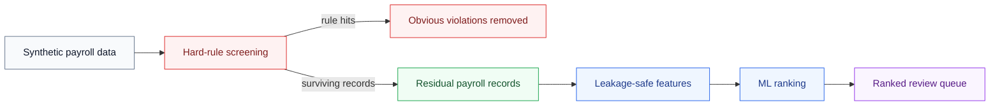

# SNF Payroll Ranker

[](https://www.python.org/downloads/release/python-3130/)
[](https://docs.astral.sh/uv/)
[](https://docs.astral.sh/ruff/)
[](https://pyrefly.org/)

A privacy-safe machine learning portfolio project for prioritizing risky SNF payroll records using synthetic data, leakage-safe temporal validation, and an employee-pay-cycle scoring pipeline.

---


---



## Highlights

- Employee-pay-cycle payroll ranking pipeline built in Python with Polars, NumPy, and scikit-learn.
- Fully synthetic payroll data so the project is public, reproducible, and portfolio-safe.
- Temporal validation and historical-only feature engineering to avoid leakage.
- Jupytext notebook reporting with a single end-to-end public analysis notebook.

## Quick Start

```bash
uv sync
uv run python -m payroll_anomaly_ranking.pipeline
```

Optional notebook dependencies:

```bash
uv sync --extra notebooks
```

## What This Repo Contains

- `src/payroll_anomaly_ranking/`: runtime pipeline, feature engineering, scoring, and evaluation
- `notebooks/snf_payroll_ranker_report.py`: primary public analysis notebook
- `tests/`: smoke and integration coverage
- `openspec/`: versioned specs and design-change history

## Docs

- [Architecture](ARCHITECTURE.md)
- [Technical Decisions](DECISIONS.md)
- [Development Guide](docs/development.md)
- [Notebook Guide](notebooks/README.md)
- [Agent Workflow](AGENTS.md)

## Project Status

The project centers an employee-pay-cycle ranking library for production-oriented SNF payroll review research.

## Notebook Output

Rendered notebook outputs are published at:

**https://nrenzoni.github.io/snf-payroll-ranker/**
